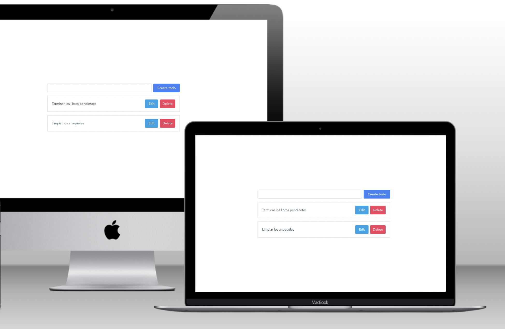

# Todo basic app

## Built with
- React
- Tailwind CSS

## Getting started
### Run it
Use the following steps to run this folder to appear:
- Open the terminal 
- Go to your directory of preference and clone this project
- Open inside the terminal the created project
- Install dependencies with 
    ~~~
    npm install
    ~~~
- Run the project with 
    ~~~
    npm run dev
    ~~~

### Deploy version
For a live demo, [click here](https://todo-list-kruger.vercel.app) 

## Author
☃️ Edwin Cacuango
- GitHub: [@EdwinCacuango](https://github.com/EdwinCacuango)
- Twitter: [@edwincacuango](https://twitter.com/edwincacuango)
- LinkedIn: [Edwin Cacuango Cahueñas](https://www.linkedin.com/in/edwin-cacuango-cahuenas/)
